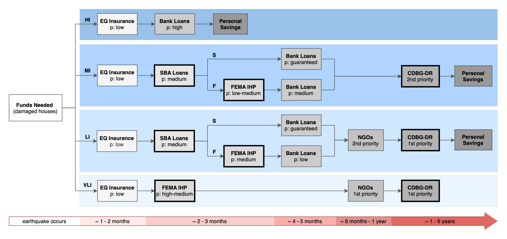

# An Agent-Based Financing Model for Post-Earthquake Housing Recovery

This repository contains the code developed for the paper: 

Alisjahbana, I., Moura-Cook, A., Costa, R., Kiremidjian, A., _In Review_, An Agent-based Financing Model for Post-Earthquake Housing Recovery: Quantifying Recovery Inequalities Across Income Groups", 

Please cite the paper if you use any data or analyses from this study. Pre-print version of the paper is available [here](https://www.researchgate.net/publication/350190559_An_Agent-based_Financing_Model_for_Post-Earthquake_Housing_Recovery_Quantifying_Recovery_Inequalities_Across_Income_Groups).

## Running Code

1. Change parameters in `configs/basecase.py`
    - A sample input file is available in `data/building_damage_owner.csv`
2. Open `sanjose_model.py` and change line 12 according to the name from step 1. Example: if the name is: `basecase.py`, then line 12 becomes: `from configs.basecase import *`
3. Create a `results` folder
4. Run the code: `python sanjose_model.py`
5. Results will be saved as `.csv` according to the name defined in `configs/basecase.py` in the `results` folder

## Visualizing Results

- `visualization_utils.py`: Functions for visualizing results
- `Visualize Results.ipynb`: Jupyter Notebook for visualizing
